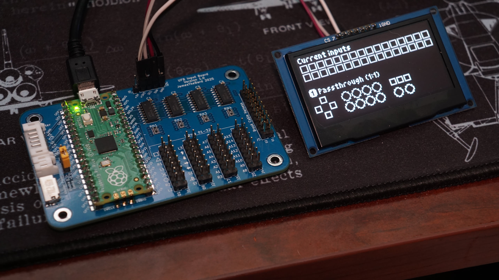
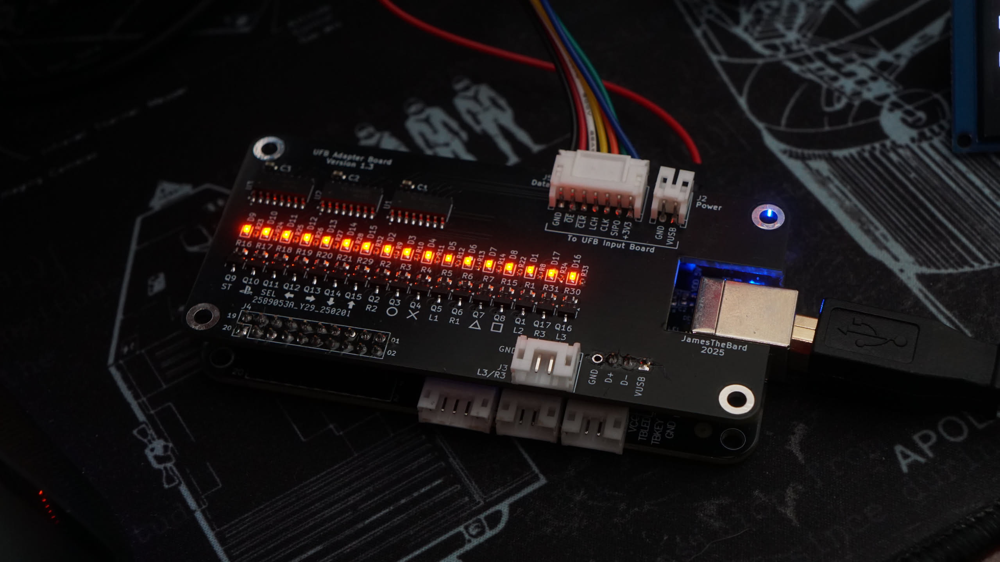

# UFB Input Board




## Profiles

To configure profiles, create the `profiles.json` file in the root of the SD card.

### File Structure

```json
{
    "profiles": [
        {
            "name": "Cool Profile 1",
            "mappings": [
                [ 1, "1FFFF"],
                [ 2, "01000"],
                [14, "00000"]
            ]
        },
        {
            "name": "Cool Profile 2",
            "mappings": [
                [12, "00003"]
            ]
        }
    ]
}
```

### Breakdown

Profiles control how the 29 inputs are mapped to the 17 outputs.  The default profile is always `Passthrough (1:1)` which is associated with profile 1.  Any profiles defined in the `profiles.json` file will show up in slot 2 and above in the order they appear in the `profiles.json` file.

The passthrough mode will have the lowest lag (around 70 microseconds worst-case scenario) and will pass the inputs directly to the Brook UFB.

A user-defined profile will use what's called the mapping mode.  This does add an additional stage of processing to the inputs which will increase lag, but not by a ton.  The more mappings added, the more time to process and the higher the lag.  However, the lag for the entire mapping processing stage shouldn't exceed 100 microseconds in the absolute worst-case scenario.

### Lag

| Mode | Absolute Worst | Typical Worst | Minimum |
|:-:|:-:|:-:|:-:|
| `passthrough` | 63.6 μsec | 47.1 μsec | 31.8 μsec |
| `mapping` | 77.6 μsec* | 54.1 μsec* | 38.8 μsec |

Notes:
- **Absolute Worst** occurs when an input gets processed and after processing another input is read.  The window for this is 31.8 microseconds in passthrough mode and 38.8 microseconds in mapping mode and pretty difficult to trigger. In mapping mode, the **Absolute Worst** and **Typical Worst** can be exceeded if a ton of button mappings are defined, but still should remain under 100 and 85 microseconds respectively.
- **Typical Worst** occurs outside of the specific case mentioned in **Absolute Worst**.  The controller polls inputs as quickly as possible, and if there are no changes in the inputs from the previous poll it skips all processing and polls again.  The interval on this is 15.3 microseconds.
- **Minimum** is the processing interval for each mode to include reading the inputs from the four `74HC165`s and writing the outputs to the three `74HC595`s.
- The stated lag does not include any lag associated with the Brook Universal Fighting Board.

### Name

The `name` field is what the display will show when you select the profile.  It's just a string that contains the name of the profile.  If you _don't_ set this, then you'll see the default name of _Unnamed Profile_.

### Mappings

The `mappings` is pretty straightforward.  The first value is the input number on the input board.  There are 29 available inputs, and the first 18 have defaults associated with them.  However, those are just suggestions and really only apply to passthrough mode (Profile 1).  You can map and input to any number of outputs (including none).

The second value is a hexidecimal representation of the outputs that will be activated when you press the input.  The first bit is output 1, second bit is output 2 and so on.  For example, in the `Cool Profile 2` profile, the first mapping shows input `12` being mapped to `00003`.

Input `12` is **left** on the D-pad/Joystick/Fightpad.  The output string breaks out as such (I'm using Python to show the number in binary).  

```python
>>> bin(0x00003)
'0b11'
```

So, starting from the right and reading to the left:
- Bit 1 is 1 which means output 1 is enabled.
- Bit 2 is 1 which means output 2 is enabled.
- The rest of the bits are 0 which means ignored.

The end result: when you press **left** (input `12`) it will activate **L2** (output `1`) and **R2** (output `2`).

For a quick snippet of Python to generate those hex values, you can do the following:

```python
>>> outputs = [1, 2, 3, 4, 5, 6, 7, 8]
>>> output_map = sum(1 << i for i in set(outputs)) >> 1
>>> hex(output_map)[2:]
'ff'
```

The example creates the hex value needed to turn on outputs 1, 2, 3, 4, 5, 6, 7, and 8. To associate this with pressing input 20:

```json
"mappings": [
    [20, "ff"]
]
```

Remember, there are 29 inputs available that can be reassigned, not just the first 18 "default" ones.

### Selecting a Profile

Inputs 31 and 32 need to be connected to buttons/momentary switches.  Input 30 should be connected to a latching switch.  When it's on then the profile is locked and cannot be changed via the other buttons.

| Input | Action |
|:-:|:--|
| `30` | Locks the profile. |
| `31` | Activates the previous profile. |
| `32` | Activates the next profile.

## Inputs and Outputs

| Input/Output | PS | XBox | Switch | Fightin' |
|:--:|:--:|:--:|:--:|:--:|
| `1` | L2 | LT | ZL | 4K |
| `2` | R2 | RT | ZR | 3K |
| `3` | Circle | B | A | 2K |
| `4` | Cross | A | B | 1K |
| `5` | L1 | LB | L | 4P |
| `6` | R1 | RB | R | 3P |
| `7` | Triangle | Y | X | 2P |
| `8` | Square | X | Y | 1P |
| `9` | Start | Start | + | Start |
| `10` | Home | Home | Home | Home |
| `11` | Select | Select | - | Select |
| `12` | Left | Left | Left | Left |
| `13` | Right | Right | Right | Right |
| `14` | Down | Down | Down | Down |
| `15` | Up | Up | Up | Up |
| `16` | L3 | LTSB | LTSB | L3 |
| `17` | R3 | RTSB | RTSB | R3 |
| `18` | TP Key | -- | -- | -- |

For inputs, there are 11 undefined inputs: `19` through `29`.  These can be mapped to any output.  More information about this can be found in the _Mapping_ section.